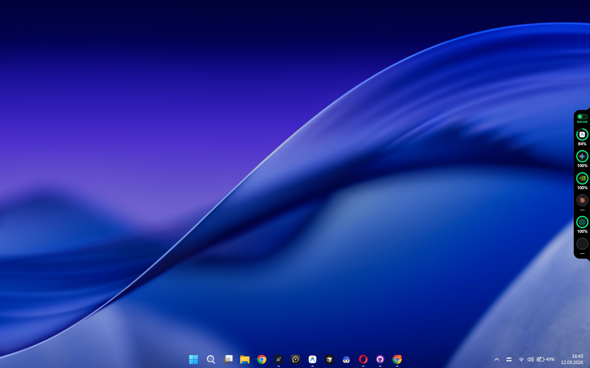

<div align="center">


**Codenotch for Windows — coding assistant kullanım limitlerini, durumlarını ve
yerel AI modellerini ekran üzerinde küçük ve sade bir arayüzle takip eden Windows portu.**



</div>

Codenotch, kullandığınız coding assistant servislerinin kullanım durumlarını
tek bir yerde görmenizi sağlar. Sağlayıcıların kullanım limitleri, aktif
oturumları ve desteklenen yerel modeller tek bir kompakt arayüzde gösterilir.

> **Not:** Windows sürümünde bazı sağlayıcıların sunduğu veriler, kullandıkları
> uygulamanın yerel oturumlarından, cache/veri dosyalarından veya resmi
> endpoint'lerden alınabilir. Sağlayıcı tarafından resmi olarak sunulmayan
> bilgiler tahmini olarak gösterilmez.

---

## Download

Windows sürümü üç farklı klasör halinde dağıtılır:

### `Portable/`

Kurulum gerektirmeyen taşınabilir sürüm.

- Dosyaları istediğiniz klasöre çıkarın.
- Uygulama dosyasını çalıştırın.
- Windows'a klasik bir kurulum yapılmaz.
- USB disk veya farklı bir klasörden çalıştırılabilir.

### `Setup/`

Windows Installer sürümü.

- Kurulum dosyasını çalıştırın.
- Kurulum sihirbazındaki adımları takip edin.
- Başlat menüsünden uygulamayı açabilirsiniz.
- Klasik Windows uygulaması gibi kurulup kaldırılabilir.

### `Source/`

Uygulamanın kaynak kodu.

Kendi Windows sürümünüzü derlemek, geliştirmek veya projeyi incelemek
istiyorsanız bu klasörü kullanabilirsiniz.

---

## Windows

Bu proje Codenotch'un Windows portudur. Mac sürümündeki temel kullanım
mantığını korurken Windows ortamına uygun dosya yolları, uygulama davranışları
ve paketleme yöntemi kullanır.

Windows sürümünde:

- Ekranın kenarında kompakt bir Codenotch arayüzü bulunabilir.
- Sağlayıcıların kullanım durumları takip edilir.
- Kullanım limitleri ve sıfırlanma zamanları gösterilir.
- Aktif, tamamlanmış veya kullanıcı müdahalesi bekleyen oturumlar
  desteklenen sağlayıcılarda gösterilebilir.
- Ayarlardan sağlayıcılar açılıp kapatılabilir.
- Desteklenen yerel AI uygulamaları otomatik olarak algılanabilir.
- Taşınabilir ve kurulumlu dağıtım seçenekleri ayrı olarak sunulur.

---

## What it reads

| Provider | Source | How |
|---|---|---|
| **Claude Code** | official / local session | Windows'taki Claude Code oturumu ve desteklenen yerel veriler üzerinden kullanım bilgisi alınır. |
| **Cursor** | official / local session | Cursor'un Windows üzerindeki oturum ve yerel uygulama verileri kullanılır. |
| **Codex** | official | Yerel Codex oturumundan ve desteklenen kullanım endpoint'lerinden limit bilgileri alınır. |
| **DeepSeek Platform** | official / derived | Codenotch içindeki oturum üzerinden hesap ve kullanım bilgileri alınabilir. |
| **Antigravity** | official where available | Yerel language server veya desteklenen quota endpoint'i kullanılır. |
| **GLM** | official | Desteklenen coding plan kullanım endpoint'i üzerinden bilgi alınır. |
| **Ollama (Local)** | local runtime | Yerel Ollama modelleri, RAM/VRAM, context ve model durumu takip edilir. |
| **LM Studio** | local runtime | LM Studio'da yüklü modeller, istek durumu, context ve desteklenen performans bilgileri okunur. |
| **Grok** | official / local session | Desteklenen Grok CLI oturum ve kullanım verileri kullanılır. |
| **OpenCode** | official | OpenCode kullanım endpoint'i ve yerel oturum bilgileri kullanılır. |
| **Command Code** | official | Desteklenen billing endpoint'leri ve yerel oturum bilgileri kullanılır. |
| **GitHub Copilot** | official | GitHub Copilot quota endpoint'i ve mevcut GitHub oturumu kullanılır. |
| **Kimi** | official | Kimi Code CLI oturumu ve desteklenen kullanım endpoint'i kullanılır. |

> Sağlayıcıların yerel dosya yapıları ve endpoint'leri zaman içinde
> değişebilir. Bu nedenle bir sağlayıcının çalışmaması uygulamanın tamamının
> bozuk olduğu anlamına gelmez.

---

## Local Ollama

**Ollama (Local)** destekleniyorsa Windows üzerinde çalışan yerel Ollama
sunucusu otomatik olarak algılanabilir.

Desteklenen bilgiler arasında:

- Yüklü modeller
- RAM / VRAM kullanımı
- Context limiti
- Model durumu
- Modelin yüklenme / boşaltılma durumu
- Destekleniyorsa generation speed (**tok/s**)
- Destekleniyorsa thinking durumu

bulunabilir.

Codenotch, monitoring amacıyla Ollama'ya kendiliğinden inference göndermez.
İzleme özelliği yalnızca mevcut yerel çalışma durumunu okumak için kullanılır.

---

## Local LM Studio

LM Studio destekleniyorsa Windows üzerinde çalışan LM Studio modelleri
otomatik olarak algılanabilir.

Arayüzde desteklenen bilgilere göre:

- Yüklü modeller
- Prompt / generation durumu
- Queue durumu
- Context kullanımı
- Token bilgileri
- Generation speed
- Model boyutu
- Quantization
- Context limiti

gösterilebilir.

Monitoring amacıyla prompt veya cevap içerikleri kaydedilmez; mümkün olan
yerlerde yalnızca durum, sayaç ve zaman bilgileri kullanılır.

---

## Provider Settings

Ayarlar bölümünden desteklenen sağlayıcıları yönetebilirsiniz.

Sağlayıcılar:

- Açılabilir veya kapatılabilir.
- Görünürlükleri değiştirilebilir.
- Destekleniyorsa sıraları değiştirilebilir.
- Kullanım verileri yenilenebilir.
- Sağlayıcıya özel ayarlar düzenlenebilir.

Bir sağlayıcı kapatıldığında Codenotch'un o sağlayıcı için yaptığı
kullanım sorguları durdurulur.

---

## Usage & Sessions

Codenotch yalnızca kullanım yüzdesini göstermekle kalmaz; desteklenen
sağlayıcılarda oturumun mevcut durumunu da gösterebilir.

Örneğin:

- **Working** — oturum aktif olarak çalışıyor.
- **Waiting** — kullanıcıdan işlem bekleniyor.
- **Done** — işlem tamamlandı.
- **Stale** — son veri güncel değil.
- **Needs authentication** — yeniden giriş yapılması gerekiyor.
- **Error** — veri alınırken hata oluştu.

Bir sağlayıcının kesin olarak yayınlamadığı bir bilgi, gerçekmiş gibi
gösterilmez.

---

## Multiple Accounts

Desteklenen sağlayıcılarda birden fazla hesabın ayrı olarak takip edilmesi
mümkün olabilir.

Örneğin farklı Claude Code veya Codex profilleri kullanıyorsanız, her profil
kendi kullanım bilgileriyle ayrı bir gösterim olarak listelenebilir.

Windows'taki profil ve uygulama veri yolları sağlayıcının kullandığı yönteme
göre değişebilir.

---

## Alerts

Kullanım limiti belirli eşiklere ulaştığında desteklenen sağlayıcılarda
Windows bildirimleri kullanılabilir.

Örneğin:

- **80%** kullanım
- **100%** kullanım

gibi eşikler için bildirim gönderilebilir.

Aynı eşik, limit penceresi gerçekten sıfırlanana kadar tekrar tekrar
bildirilmez.

---

## Placement

Codenotch'un Windows arayüzü ekranın kenarında kompakt bir görünüm olarak
çalışacak şekilde tasarlanmıştır.

Desteklenen sürüme göre:

- Ekran kenarına sabitleme
- Konum değiştirme
- Boyutlandırma
- Her zaman gösterme
- Otomatik gizleme
- Açıkken sabit tutma

gibi seçenekler kullanılabilir.

Birden fazla monitör kullanılıyorsa davranış Windows'un ekran ve pencere
yönetimine göre belirlenir.

---

## Appearance

Görünüm ayarlarından desteklenen seçenekler değiştirilebilir.

Bunlar arasında:

- Arayüz boyutu
- Accent renkleri
- Gösterim biçimi
- Otomatik gizleme
- Sabit gösterim
- Windows bildirimleri

bulunabilir.

Codenotch'un temel amacı küçük ve dikkat dağıtmayan bir arayüz sunmaktır.

---

## Portable vs Setup

| Özellik | Portable | Setup |
|---|---|---|
| Kurulum gerekir | Hayır | Evet |
| Başlat menüsü entegrasyonu | Sınırlı / manuel | Evet |
| Kaldırma işlemi | Dosyaları silerek | Windows üzerinden |
| USB'den çalıştırma | Evet | Genellikle hayır |
| Kullanım kolaylığı | Teknik kullanıcılar için | Günlük kullanım için |

İlk kez kullanıyorsanız **Setup** sürümü önerilir.

Kurulum yapmak istemiyorsanız **Portable** sürümünü kullanabilirsiniz.

---

## Building from Source

Kaynak kodu `Source/` klasöründe bulunur.

Geliştirme ortamını kurduktan sonra proje dosyalarındaki build talimatlarını
takip ederek Windows için Debug veya Release sürümü oluşturabilirsiniz.

Örnek genel akış:

```powershell
cd Source
# bağımlılıkları yükleyin
# projeyi build edin
# uygulamayı çalıştırın
```

> Kullanılan framework ve build komutları kaynak kodun mevcut sürümüne göre
> değişebilir. Kesin komutlar `Source/` klasöründeki proje dosyalarından takip
> edilmelidir.

---

## Development / Demo Mode

Geliştirme sırasında gerçek sağlayıcı hesaplarına bağlanmadan uygulamanın
arayüzünü test etmek için demo verileri kullanılabilir.

Demo modu mevcut sürümde destekleniyorsa, ilgili environment variable veya
development ayarı üzerinden etkinleştirilir.

---

## Architecture

Her provider kendi kullanım verisini sağlayan ayrı bir adapter olarak
çalışır.

Temel mimari:

```text
Provider
   │
   ▼
Usage Provider / Adapter
   │
   ▼
Usage Store
   │
   ├── Last known reading
   ├── Current status
   └── Refresh / polling
   │
   ▼
Codenotch UI
```

Bu yapı sayesinde yeni bir provider eklemek veya mevcut provider'ın veri
kaynağını değiştirmek mümkün olur.

Provider verileri mümkün olduğunda şu güven seviyelerinden biriyle
değerlendirilir:

- **Official** — sağlayıcının resmi verisi
- **Derived** — resmi verilerden türetilen bilgi
- **Local** — kullanıcının bilgisayarındaki uygulama/runtime verisi
- **Manual** — kullanıcı tarafından sağlanan bilgi

Bir provider hata verdiğinde uydurma bir kullanım yüzdesi göstermek yerine
durum kullanıcıya açık şekilde bildirilir.

---

## The honest caveat

Hiçbir coding assistant sağlayıcısı her zaman "oturum limitinin tam olarak
%N'i kullanıldı" şeklinde herkese açık ve değişmez bir API sunmaz.

Bu nedenle Codenotch bazı sağlayıcılarda:

- resmi API,
- yerel uygulama verisi,
- CLI oturumu,
- local runtime,
- cache,
- language server,
- veya desteklenen başka bir veri kaynağı

kullanabilir.

Bu kaynakların yapısı sağlayıcı tarafından değiştirilebilir. Böyle bir
değişiklik olduğunda ilgili provider güncellenmelidir.

Codenotch'un amacı olmayan bir veriyi varmış gibi göstermek değil, mevcut
veriyi mümkün olduğunca doğru ve şeffaf şekilde göstermektir.

---

## Troubleshooting

### Provider görünmüyor

Şunları kontrol edin:

1. İlgili uygulama Windows'ta kurulu mu?
2. Hesabınızda oturum açık mı?
3. Provider Codenotch ayarlarından etkin mi?
4. İlgili CLI veya uygulamanın kendi oturumu çalışıyor mu?
5. Uygulamayı yeniden başlatmak gerekiyor mu?

### Usage bilgisi güncellenmiyor

Provider'ın resmi endpoint'i veya yerel veri formatı değişmiş olabilir.
Önce provider'ın kendi uygulamasında kullanım bilgilerinin doğru görünüp
görünmediğini kontrol edin.

### Uygulama açılmıyor

Portable sürüm kullanıyorsanız klasördeki gerekli dosyaların tamamının
birlikte bulunduğundan emin olun.

Setup sürümünde sorun yaşıyorsanız uygulamayı kaldırıp yeniden kurmayı
deneyebilirsiniz.

---

## Contributing

Katkıda bulunmak istiyorsanız `Source/` klasöründeki kaynak kodu kullanarak
değişikliklerinizi hazırlayabilirsiniz.

Özellikle yeni provider eklerken:

- Veri kaynağını açıkça belirtin.
- Resmi olmayan veriyi resmi veri gibi göstermeyin.
- Hataları görünür bir provider durumuna dönüştürün.
- Kullanıcı kimlik bilgilerini gereksiz yere kopyalamayın veya saklamayın.
- Mevcut provider'ların davranışını bozmadığınızdan emin olun.

---

## License

[MIT](LICENSE) © 2026 Vinz
